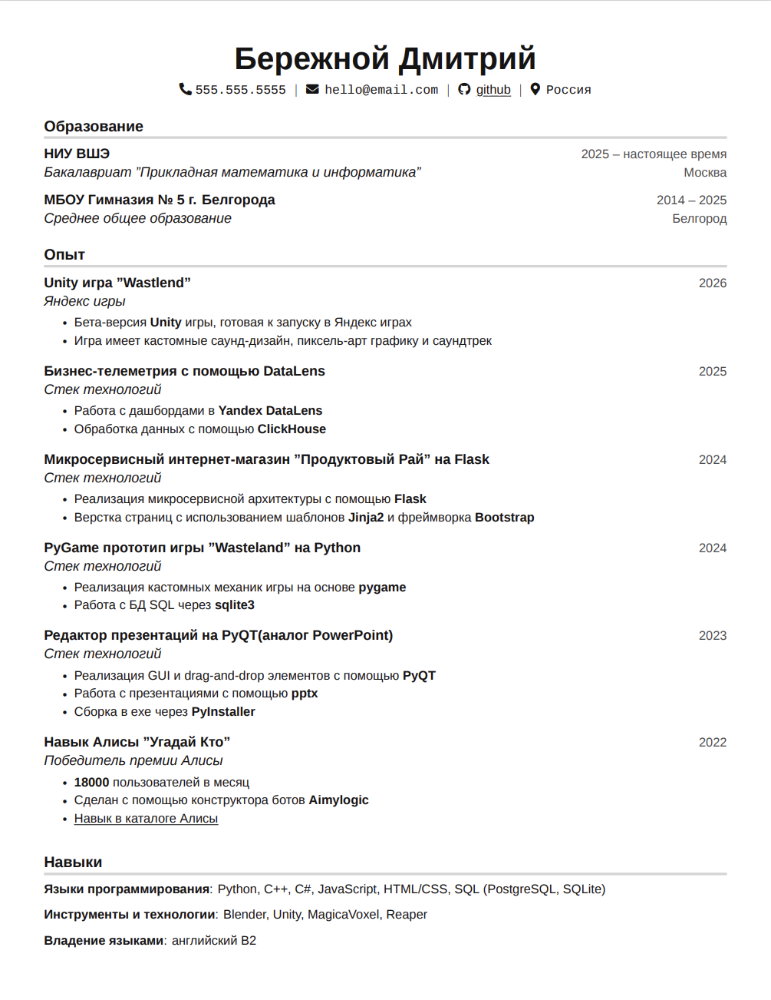

# HomeWorkCV

## Структура
* CV
* * Dockerfile
* * main.tex - резюме в техе
* * build.bash - запуск сборки в PDF
* choose_system - скрипт из условия для выбора системы
* main.pdf - собранное резюме (на всякий случай)
* README.md
* build_pdf.cast - каст терминала, на нем видно, что контейнер запускается и PDF сборка успешно завершается
## Инфо
* Сборка LaTeX резюме (шаблон взят с Overleaf) в PDF, с использованием Docker контейнера 
* Система: debian:11-slim (мне выдал скрипт систему debian:10.3, но я так понял debain 10-й версии не поддерживается сейчас, поэтому поставил debian поновее)
* Реальные email и телефон не указывал, т.к. репозиторий публичный
## Запуск
* Запуск из директории CV (с main.tex, build.bash и main.tex внутри):
* * docker build --tag cv-latex:cv-latex123 -f Dockerfile .
* * docker run -v $(pwd)/output:/cv/output cv-latex:cv-latex123
* * При старте контейнера выполнится bash скрипт и main.pdf загрузится в output, которая появится в текущей папке. Контенйер потом сам остановится
* * Можно потом удалить через docker rm <ID контейнера>
